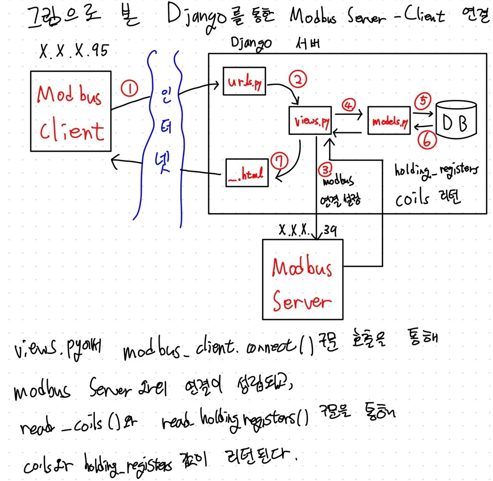

# modbusRasberryPi

라즈베이파이 모델을 이용해 modbus TCP 통신의 동작을 확인한다.



## 라즈베리파이 모델


컴파일 테크놀로지 사의 컴파일 파이 제품군중 [CPi-A070WR](https://www.comfile.co.kr/shop/goods/goods_view.php?goodsno=386&category=014)을 사용해 진행했다.

해당 모델을 ModbusTCP 프로토콜의 Client로 설정, ModbusTCP Server와의 통신을 구현한다.

## modbusClient 프로그램

```python
modbus_client=ModbusClient('192.168.0.39',502) #Modbus Server IP 연결  
modbus_client.parity = Parity.even #짝수 패리티
modbus_client.unitidentifier = 1 #slave id 
modbus_client.baudrate = 9600  #전송속도 보오 레이트
modbus_client.stopbits = Stopbits.one #정지 비트  데이터 송출 종료 알림
modbus_client.connect()

```
해당 라즈베리파이 모델 (IP: x.x.x.95 )과 ModbusTCP Server (IP: x.x.x.39 )의 연결을 설정한다. 
```python
def index(request):
    coils = modbus_client.read_coils(0, 10)
    holding_registers=modbus_client.read_holdingregisters(0,10)

    
    for i in range(10):
        for index in range(random.randrange(0,10)):
            modbus_client.write_single_coil(index, not coils[index])
            item =Digital.objects.get(id=index)
            item.coil_value = not coils[index]
            item.save()
        
        randNum=random.randint(0,32767)
        if holding_registers[i] != None:
            modbus_client.write_single_register(i,randNum)
            item =Analog.objects.get(id=i)
            item.register_value = randNum
            item.save()

    coils = modbus_client.read_coils(0, 10)
    holding_registers=modbus_client.read_holdingregisters(0,10)
    
    indexCoils = dict(enumerate(coils))
    indexRegisters =dict(enumerate(holding_registers))
    
    context={'coils': indexCoils ,'registers': indexRegisters}
    return render(request,'modbusRasberryPi/list.html',context)

```

modbusTCP 통신이 올바르게 연결되었는지 확인하기 위해 randomrange(0,10)만큼의 coil값을 바꾸고, randomNum의 register값으로 임의 갱신한다.


